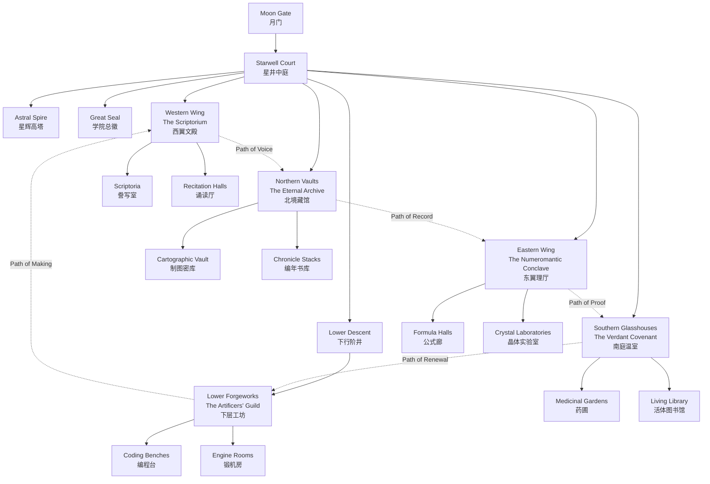
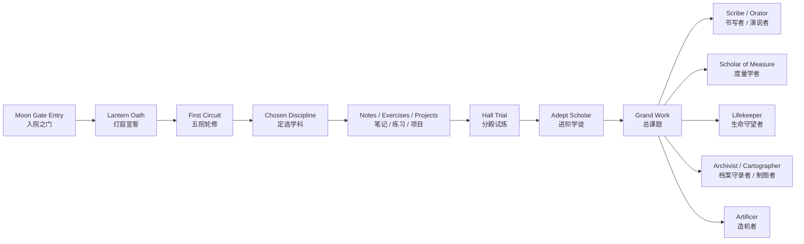

# Arcanum-Academy

When the lanterns along the old stone halls are lit, every subject becomes a doorway.

当古老石廊两侧的灯火被点亮，每一门学科都会成为一道通往未知的门。

The greatest mysteries were never sealed away. They simply waited for those willing to study them with patience, wonder, and resolve.

那些最伟大的奥秘从未真正被封存，它们只是在等待愿意以耐心、敬畏与恒心去研习的人。

---

## Overview | 学院简介

Arcanum Academy is a fantasy-themed learning repository that reimagines modern subjects as living branches of arcane study. Here, mathematics becomes a language of hidden order, biology becomes a covenant with living systems, history becomes an archive of civilization and memory, and code becomes a form of crafted intelligence.

Arcanum Academy 是一个以奇幻学院为世界观的学习仓库。它将现代学科重塑为具有生命力的神秘学术体系：数学是隐藏秩序的语言，生物是与生命法则缔结的盟约，历史是文明与记忆的档案，而代码则是一种被锻造出来的智能工艺。

This repository is intended to grow over time into a personal academy of notes, lessons, exercises, references, and worldbuilding. It is both a study archive and an imaginative map of knowledge.

这个仓库将随着时间逐步扩展为一座个人学院，收录笔记、课程、练习、参考资料以及世界观设定。它既是一座学习档案馆，也是一张带有幻想色彩的知识地图。

---

## Vision | 愿景

To build a living academy where knowledge remains rigorous, beautiful, and filled with wonder.

建立一所持续生长的学院，让知识既严谨有序，也保有美感与神秘。

To let learning feel less like storage and more like pilgrimage.

让学习不只是收纳知识，而更像一次缓慢而坚定的朝圣。

---

## Motto | 院训

Seek wonder. Keep discipline. Leave a living record.

怀抱好奇，恪守秩序，留下仍会生长的记录。

A shorter ceremonial rendering used within the academy:

学院内部仪式场合中使用的短式院训：

Wonder in the heart. Order in the hand.

心怀奇迹，手持秩序。

---

## The Great Seal | 学院总徽设定

The grand seal of Arcanum Academy is imagined as a five-pointed sigil arranged around a central lantern flame.

Arcanum Academy 的总徽被设定为一枚围绕中央灯火展开的五芒学印。

Its symbolic elements are:

其象征元素如下：

| Element | Meaning |
| --- | --- |
| Central Lantern Flame | The light of inquiry, never inherited whole, only rekindled. 求知之火，无法被完整继承，只能被再次点燃。 |
| Five Surrounding Sigils | The Five Orders, each guarding a different path to understanding. 五大学术分支，各自守护通往理解的不同道路。 |
| Circular Outer Ring | Continuity, discipline, and the promise that learning never truly ends. 象征延续、秩序，以及学习永不真正终止。 |
| Open Lower Arc | The academy remains unfinished by design, leaving space for future disciplines and personal growth. 下方留白的开口象征学院刻意保持未完成状态，为未来学科与个人成长预留空间。 |

Suggested heraldic palette:

建议的总徽配色：

| Color | Symbolism |
| --- | --- |
| Gold | Illumination, aspiration, and noble effort. 启明、追求与高贵的努力。 |
| Deep Blue | Knowledge, silence, and the night sky of contemplation. 知识、静思与沉默夜空。 |
| Ivory | Record, parchment, and memory made tangible. 纸页、记述与可被触碰的记忆。 |

---

## The Five Orders | 五大学术分支

| Order | Focus | Description | Emblem |
| --- | --- | --- | --- |
| 📜 The Scriptorium | Language Arts and English 语文与英语 | A house of words, rhetoric, reading, and expression. Here, language is treated as both scholarship and spellcraft. 掌管文字、修辞、阅读与表达的学派。在这里，语言既是学术，也是魔法。 | A quill crossing an open scroll, sealed with red wax. 羽笔与展开卷轴交叉，其上覆以赤蜡封印。 |
| 📐 The Numeromantic Conclave | Mathematics, Physics, Chemistry 数学、物理、化学 | The domain of number, law, matter, and reason. It studies the hidden structure behind patterns, motion, and transformation. 研究数字、规律、物质与理性的学派，探索现象背后的结构、运动与变化。 | A brass compass enclosing a triangle of stars. 黄铜圆规包围着一枚星辉三角。 |
| 🌱 The Verdant Covenant | Biology 生物 | The study of life, growth, adaptation, and natural harmony. This branch listens to the logic written in living forms. 研究生命、生长、适应与自然秩序的分支，关注万物在生命形态中的规律。 | Antlers grown from intertwined vines around a seed. 藤蔓交缠而成的鹿角，中央托起种子。 |
| 📖 The Eternal Archive | History and Geography 历史与地理 | A grand archive of time and world. It preserves memory, maps civilizations, and traces the paths of land, people, and eras. 掌管时间与世界的宏大档案馆，记录文明、地域、历史进程与人类足迹。 | An astrolabe laid over an hourglass and map lines. 星盘覆盖沙漏与地图经纬。 |
| 🤖 The Artificers' Guild | Information Technology 信息技术 | A guild of makers, builders, and system-weavers. It transforms logic into tools, code, and crafted intelligence. 属于创造者与构筑者的公会，将逻辑转化为工具、代码与可运行的智能结构。 | A gear halo around a crystal core. 齿轮光环环绕一枚晶核。 |

### Order Maxims and Entrance Vows | 五大学派格言与入院誓词

| Order | Maxim | Entrance Vow |
| --- | --- | --- |
| 📜 The Scriptorium | Let no word be empty, and no silence go unread. 言辞不可空泛，沉默亦须读懂。 | I vow to weigh every word before I cast it into the world, and to read with equal care what others leave behind. 我誓将每一句话在说出前反复斟酌，也将以同样的慎重阅读他人留下的痕迹。 |
| 📐 The Numeromantic Conclave | Measure clearly. Prove faithfully. Doubt precisely. 清晰度量，如实证明，精确怀疑。 | I vow to follow pattern without superstition, to test law without pride, and to accept truth whether elegant or severe. 我誓不以迷信追随规律，不以傲慢检验法则，并接受一切真实，无论其优雅或严峻。 |
| 🌱 The Verdant Covenant | Guard what grows, and learn from what changes. 守护生长之物，倾听变化之理。 | I vow to study life without arrogance, to honor fragility without fear, and to remember that every living form is also a text. 我誓不以傲慢观察生命，不以恐惧面对脆弱，并铭记每一种生命形态本身也是一部可被阅读的典籍。 |
| 📖 The Eternal Archive | Remember truly, and map the world with humility. 如实记忆，以谦卑描摹世界。 | I vow to preserve the past without ornament, to chart the world without haste, and to leave the record clearer than I found it. 我誓不以修饰歪曲过去，不以仓促描绘世界，并使我所接手的记录比原先更加清明。 |
| 🤖 The Artificers' Guild | Forge with reason, and let craft answer thought. 以理性锻造，让工艺回应思想。 | I vow to build what can endure, to name every part with purpose, and to let invention serve understanding rather than vanity. 我誓建造经得起时间考验之物，令每一个构件皆有其意，并让发明服务于理解，而非虚荣。 |

### Order Vestments and Heraldic Colors | 学派服饰与代表色

| Order | Heraldic Colors | Vestments |
| --- | --- | --- |
| 📜 The Scriptorium | Crimson, parchment ivory, and ink black 赤绯、纸页象牙白与墨黑 | Members of the Scriptorium favor layered robes with wide sleeves, wax-sealed sashes, and cuffs embroidered with short runic phrases. Formal readers wear mantle-cloaks lined like the margins of illuminated manuscripts. 典籍院成员多穿宽袖叠层长袍，配赤蜡封带，袖口常绣有短句符文。正式诵读场合则披带有手抄典籍边栏纹样的披肩。 |
| 📐 The Numeromantic Conclave | Brass gold, midnight blue, and chalk white 黄铜金、午夜蓝与粉笔白 | Their attire is sharply cut and geometric, often marked by measured pleats, metallic clasps, and star-gridded hems. Senior apprentices wear shoulder capes stitched with triangles, circles, and proof marks. 数秘议会的服饰线条克制而分明，常见规则褶线、金属扣件与星格下摆。高阶学徒的肩披上会缀有三角、圆环与证明记号。 |
| 🌱 The Verdant Covenant | Moss green, seed gold, and bark brown 苔绿、种籽金与树皮褐 | Their robes are softer and more mobile, made for garden paths and glasshouse study, with vine-knot cords, leaf-shaped clasps, and hems dyed in gradual shades like seasons turning. 翠契学派的衣着更柔软轻便，适合穿行温室与园圃，常配藤结束绳、叶形胸扣，以及如季节递变般渐染的衣摆。 |
| 📖 The Eternal Archive | Dust blue, silver-gray, and map tan 尘蓝、银灰与舆图褐 | Archivists and cartographers wear long coats or scholar mantles with hidden inner pockets, narrow belts for instruments, and lining patterned like faint contour lines or old atlas borders. 永恒档案馆的成员多穿长外袍或学者披衣，内侧暗袋用于收纳文书与器具，腰间细带便于悬挂测绘工具，内衬常印有等高线或旧地图边框纹样。 |
| 🤖 The Artificers' Guild | Iron gray, ember orange, and crystal cyan 铁灰、炉焰橙与晶青 | Guild attire combines workshop practicality with arcane precision: fitted coats, reinforced gloves, tool-belts, and luminous stitched seams that resemble circuit paths in low light. 造机公会的服饰兼具工坊实用性与奥术精密感，常见合身外套、加固手套、工具腰带，以及在暗处宛如回路的发光缝线。 |

---

## Disciplines | 学科目录

| Directory | Subject | Meaning |
| --- | --- | --- |
| runic-script | 语文 | The study of native language, literature, and written expression. 本族语言、文学与书面表达之学。 |
| Lingua-Arcana | 英语 | The learning of English as the language of wider worlds and older wisdom. 作为通向更广阔世界之语言的英语学习。 |
| arithmancy | 数学 | Number, structure, proof, and abstraction. 数量、结构、证明与抽象思维。 |
| aethermancy | 物理 | Motion, force, energy, and the laws of the world. 运动、力、能量与世界运行规律。 |
| alchemy | 化学 | Matter, reaction, composition, and transformation. 物质、反应、组成与变化。 |
| sylvan-codex | 生物 | Life systems, organisms, ecology, and inheritance. 生命系统、生物个体、生态与遗传。 |
| chronicle-of-ages | 历史 | Civilizations, events, memory, and temporal continuity. 文明、事件、记忆与时间脉络。 |
| astral-cartography | 地理 | Space, landscape, environment, and human-earth relations. 空间、地貌、环境与人地关系。 |
| golemcraft | 信息技术 | Computation, digital tools, systems, and creation through code. 计算、数字工具、系统设计与代码创造。 |

---

## Academy Map | 学院地图说明

Arcanum Academy is imagined not as a single building, but as a layered scholastic citadel arranged around a central axis of light.

Arcanum Academy 并非一栋单独建筑，而是一座围绕中央光轴建成的多层学术城堡。

### Schematic Diagram | 学院地图示意图

The diagram below expands the academy into a regional relationship map. Solid lines indicate direct access, while dotted lines trace the traditional inter-order study circuit.

下图将学院扩展为一张区域关系图。实线表示直接通行，虚线表示学徒在五大学派之间轮转研习的传统路径。



### Central Grounds | 中央主院

At the heart of the academy stands the Lantern Court, a circular plaza where all disciplines meet. In its center rises the Astral Spire, a symbolic tower of inquiry. Every branch of study begins here, beneath the same flame.

学院中央是灯庭广场，一处让所有学科彼此交汇的圆形主院。广场中央矗立着星辉高塔，象征一切探索的起点。所有学科都从这里出发，在同一簇灯火下展开。

### Western Wing | 西翼文殿

The Scriptorium occupies the western cloisters, where scriptoria, recitation halls, and chambers of rhetoric echo with ink, parchment, and spoken language.

文字学派位于学院西翼长廊，誊写室、诵读厅与修辞厅散布其间，空气中仿佛始终留着墨香、纸页与回声。

### Eastern Wing | 东翼理厅

The Numeromantic Conclave resides in the eastern halls of instruments and formulae, where diagrams, measures, and transformations are studied with austere precision.

数理学派位于东翼的仪器厅与公式廊。那里充满刻度、图式与实验台，规律与变化在冷静而精确的秩序中被观察。

### Southern Glasshouses | 南庭温室

The Verdant Covenant grows in the southern conservatories, gardens, and living libraries, where roots, spores, tissues, and ecosystems are observed as sacred patterns of life.

生命学派位于南庭温室、药圃与活体图书馆之间。根系、孢子、组织与生态在这里被视为生命书写出的神圣纹路。

### Northern Vaults | 北境藏馆

The Eternal Archive stands in the north: part library, part observatory, part cartographic vault. It preserves old empires, old roads, and the shifting memory of the world.

永恒档案馆位于学院北侧，兼具图书馆、观象台与制图密库的性质。它保存古老帝国、古老道路，以及世界持续变动的记忆。

### Lower Forgeworks | 下层工坊

Beneath the visible halls lies the Artificers' Guild, a network of workshops, engine rooms, and rune-lit chambers where logic is forged into mechanisms, systems, and living tools.

在学院可见建筑之下，分布着工匠公会的下层工坊。这里有齿轮室、锻机房与符文照明的构造间，逻辑在此被塑造成机械、系统与可运行的工具。

---

## Apprentice Codex | 学徒守则 / 校规

The following rules are traditionally recited to all new apprentices on the night they first enter the Lantern Court.

以下守则通常会在新学徒首次进入灯庭的夜晚被正式宣读。

1. Keep the flame of inquiry. Ask without mockery, answer without contempt. 你应守护求知之火。提问不可带讥，作答不可带傲。
2. Record what you learn. A lesson unkept is a lantern left to die in wind. 你应记录所学。未被保存的知识，如同风中将熄的灯。
3. Disturb no archive, garden, laboratory, or forge through carelessness. Negligence is treated as a breach of scholarship. 不可因疏忽扰乱档案、园圃、实验室或工坊。怠慢被视为对学术本身的冒犯。
4. Credit every source, every teacher, and every companion in study. Nothing stolen grows cleanly in this academy. 你应注明每一份来源、每一位师长与每一位同伴。凡窃取而来的知识，都无法在学院中正当地生长。
5. Argue against error, not against dignity. Precision is required; humiliation is forbidden. 你应反驳错误，而非折损他人尊严。学院要求精确，不容羞辱。
6. Do not build what you refuse to understand, and do not command what you are unwilling to maintain. 不可建造自己不理解之物，也不可驱使自己不愿维护之物。
7. Return each hall better than you found it: clearer shelves, cleaner benches, calmer notes, truer records. 你离开任何一处殿堂时，都应使其比初来时更好：架上更整，台面更净，笔记更清，记录更真。
8. Remember that mastery grants stewardship before it grants privilege. In Arcanum Academy, skill increases duty. 你应铭记，精通首先带来守护之责，而非特权。在 Arcanum Academy，能力越高，责任越重。

---

## Faculty Titles and Rank Structure | 导师头衔与职阶体系

The academy's mentors are ranked not only by seniority, but by the scope of stewardship they are trusted to carry.

学院中的导师并不只按资历排序，更按他们被托付去守护的知识范围与责任而定阶。

| Rank Tier | Title | Charge | Sign of Office |
| --- | --- | --- | --- |
| I | Lantern Tutor 灯引导师 | Guides new apprentices through oath-taking, first notes, and the discipline of keeping record. 负责引导新学徒完成入院誓仪、初次记录与最基础的学习秩序。 | A single gold thread stitched at the cuff. 袖口一缕金线。 |
| II | Hall Mentor 分殿导师 | Oversees instruction within a specific hall, corrects study method, and sets regular exercises. 负责具体分殿的授课、纠正学习方法并布置常规试练。 | A clasp bearing the emblem of one order. 佩戴对应学派徽记的领扣。 |
| III | Senior Preceptor 高阶训导师 | Designs longer courses, presides over trials, and judges whether work is ready to enter the archive. 设计完整课程，主持试炼，并裁定作品是否具备入档资格。 | A mantle-edge marked with silver proof-stitches. 披肩边缘缀有银色证明缝纹。 |
| IV | Order Warden 学派守望 | Keeps the lore, customs, and standards of an entire order, and appoints mentors beneath that hall's authority. 守护整个学派的传统、规范与学术标准，并任命该学派内部的导师。 | A signet ring engraved with the order seal. 佩戴刻有学派印记的戒章。 |
| V | Rector of the Astral Spire 星塔院正 | Holds academy-wide stewardship, resolves matters between orders, and speaks the final word on ceremonial and scholarly law. 负责学院整体事务，裁决学派之间的事务，并对礼制与学术规则拥有最终解释权。 | A lantern-staff crowned with the fivefold seal. 持有顶端嵌五芒总徽的灯杖。 |

In addition to these formal ranks, the academy may invite Visiting Sages 游席贤者 to teach a single season, lecture, or special craft.

除正式职阶外，学院也会邀请“游席贤者”短期驻留，负责讲授某一学季、专题讲座或特别工艺。

---

## Apprentice Progression | 学徒成长路径图

The path below describes the academy's common pattern of study, from entry through specialization and final calling.

下图展示学院最常见的学习轨迹：从入院、轮修、定向，到最终形成各自的学术归向。



Each subject directory below may serve as the front hall of one chosen path.

下方每一个学科目录，都可以被视为某条专修道路的序厅。

---

## Repository Structure | 仓库结构

Arcanum Academy is currently arranged as follows:

Arcanum Academy 当前结构如下：

```text
arcanum-academy/
│
├── 📜 The Scriptorium/
│   ├── runic-script/
│   └── Lingua-Arcana/
│
├── 📐 The Numeromantic Conclave/
│   ├── arithmancy/
│   ├── aethermancy/
│   └── alchemy/
│
├── 🌱 The Verdant Covenant/
│   └── sylvan-codex/
│
├── 📖 The Eternal Archive/
│   ├── chronicle-of-ages/
│   └── astral-cartography/
│
└── 🤖 The Artificers' Guild/
    └── golemcraft/
```

Each folder is both a practical study directory and a location within the academy's imagined world.

每一个目录既是实际的学习分类，也是学院地图中的一处地点。

---

## Usage | 使用方式

Each subject folder can be expanded into lesson plans, notes, exercises, reading lists, project ideas, and themed worldbuilding material.

每个学科目录都可以继续扩展为课程大纲、学习笔记、练习题、阅读清单、项目构想，以及与学院设定相呼应的世界观内容。

A useful way to treat the repository is:

你可以将这个仓库理解为：

| Repository Function | In-Universe Interpretation |
| --- | --- |
| Notes | Study scrolls and field journals 学习卷轴与研习日志 |
| Exercises | Trials, drills, and minor examinations 试炼、操练与小型考核 |
| References | Archive holdings and indexed tomes 档案馆藏与索引典籍 |
| Projects | Workshop commissions and experimental constructs 工坊委托与实验造物 |
| Worldbuilding | Records of academy lore and institutional memory 学院传说与制度记忆 |

---

## Future Additions | 可继续扩展的设定

In time, this academy may grow to include:

随着学院成长，未来还可以继续加入：

- House laws or study vows 学院守则或学徒誓言
- Seasonal terms and ceremonial festivals 学期制度与节庆仪式
- Named halls, towers, gardens, and laboratories 具名的高塔、庭院与实验室
- Faculty titles, ranks, and fictional mentors 导师头衔、阶位与虚构师长
- A visual crest system for each discipline 各学科的可视化徽章系统

---

## Closing | 结语

In time, Arcanum Academy may become not only a study repository, but a map of a personal world of knowledge, memory, and craft.

随着内容逐步累积，Arcanum Academy 可以不仅是一个学习仓库，也是一张属于你自己的知识、记忆与创造之地图。

Every page added is another lamp lit in the halls.

每添一页，便又有一盏灯在学院中被点亮。