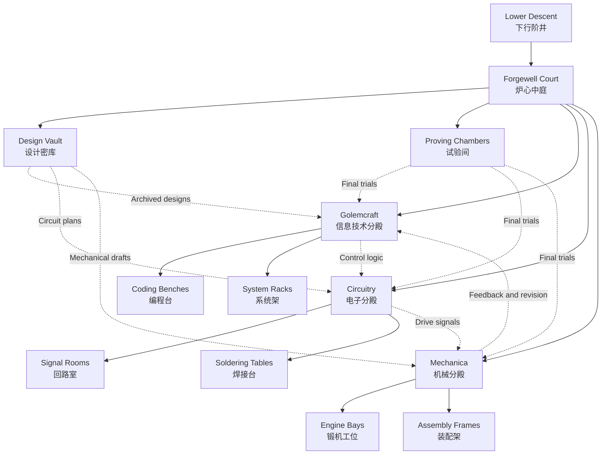

# The Artificers' Guild | 造机公会

Below the academy's visible halls lies a quieter dominion of benches, gears, sealed engines, and rune-lit worktables.

在学院可见殿堂之下，坐落着一片更安静的领域：那里有工作台、齿轮、封装锻机与被符文照亮的构造桌。

This is the order of makers, builders, and system-weavers, where thought is not only studied but assembled into forms that can act in the world.

这里是创造者、构筑者与系统编织者所属的学派。在这里，思想不只被研究，也被装配成能够在现实中运作的形体。

---

## Guild Charge | 公会之责

The Artificers' Guild studies computation, circuits, mechanisms, digital tools, and the disciplined design of systems. It asks every apprentice to understand what they build, to document what they change, and to test what they intend others to trust.

造机公会研习计算、电路、机械、数字工具与系统化构造之术。它要求每一位学徒理解自己建造之物，记录自己改动之处，并验证那些准备交给他人信赖的结构。

## Guild Emblem | 公会总徽

The guild's emblem is a gear halo around a crystal core. The gear halo represents assembly, repeatable process, and the discipline of interlocking parts; the crystal core represents stored logic, focused intent, and the spark that turns structure into action.

公会总徽是一枚环绕晶核的齿轮光环。齿轮光环象征装配、可重复的流程与彼此咬合的构件秩序；中央晶核则象征被收束的逻辑、集中的意志，以及让结构真正开始运转的火花。

Its heraldic colors are iron gray, ember orange, and crystal cyan.

其代表色为铁灰、炉焰橙与晶青。

## Lower Forgeworks | 下层工坊

The lower levels of the guild are traditionally divided into benches for coding, circuit rooms for signal craft, engine bays for mechanical study, vaults for archived designs, and testing chambers where constructs are proven before they are named complete.

公会的下层工坊通常分为编程台、研习信号构造的回路室、用于机械研究的锻机工位、设计归档密库，以及用于验证构造之物是否足以称作完成的试验间。

No serious mechanism is accepted into the guild record without passing through naming, assembly, and proof.

任何严肃的构造，若未经过命名、装配与验证三道程序，便不会被正式收入公会档案。

### Inner Map | 内部结构图

The map below presents the lower forgeworks as a shared workshop complex. Solid lines mark direct passage, while dotted lines trace the guild's customary paths of collaboration between code, signal, and mechanism.

下图将下层工坊描绘为一座彼此联通的构造群。实线表示直接通行，虚线表示代码、信号与机械之间的传统协作路径。

## Present Disciplines | 现行分殿

| Directory | Subject | Charge |
| --- | --- | --- |
| [golemcraft](golemcraft/README.md) | 信息技术 | The forge of computation, code, debugging, and practical system craft. 计算、代码、调试与系统实践的锻造分殿。 |
| [circuitry](circuitry/README.md) | 电子 | The chamber of circuits, components, sensing, and signal-bearing design. 电路、元件、传感与信号构造之分殿。 |
| [mechanica](mechanica/README.md) | 机械 | The workshop of structure, transmission, assembly, and disciplined motion. 结构、传动、装配与秩序化运动之分殿。 |

## Guild Saying | 公会短谚

Forge with reason, and let craft answer thought.

以理性锻造，让工艺回应思想。